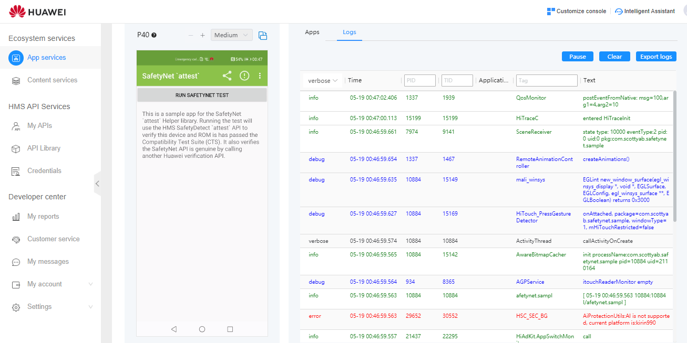
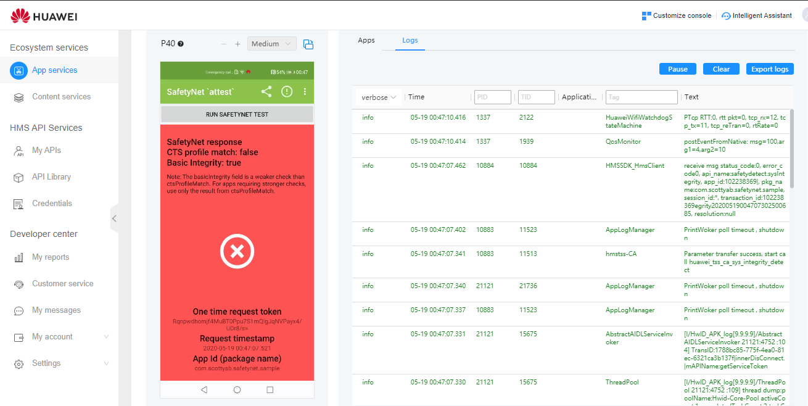

HMS SafetyNet `attest()` Helper
================

HMS SafetyNet Helper wraps the Huawei Mobile Services Safety Detect SysIntegrity API and verifies Safety Net API response with the [Huawei Safety Detect - SysIntegrity API](https://developer.huawei.com/consumer/en/doc/development/HMS-Guides/SafetyDetectSysIntegrityDevelopment). Note this is a client only validation, it's recommended to include [server side validation]().

Extract from Android [SafetyNet API doc](https://developer.android.com/google/play/safetynet/index.html)

*Check if your app is running on a device that matches a device model that has passed Android compatibility testing. This analysis can help you determine if your app will work as expected on the device where it is installed. The service evaluates both software and hardware characteristics of the device, and may use hardware roots of trust, when available.*

##Features

* Calls Huawei Mobile Services Safety Detect test
* Local verification of request
* Verifies SysIntegrity API response

## Requires / Dependencies

* Huawei Mobile Services
* Requires Internet permission
* Huawei API key for the [Safety Detect - SysIntegrity API](https://developer.huawei.com/consumer/en/doc/development/HMS-Guides/SafetyDetectSysIntegrityDevelopment)

##Server Validation!!!
This library was built to get app developers up and going with SafetyNet attest API.
With skill and time any device based checks can be bypassed. This is why the validation should be handled by the server. Therefore you should look at implementing more robust and secure validation of the `attest` response via a server-side component.

* App requests the nonce / request token from your server
* Call `SafetyNet.SafetyNetApi.attest(googleApiClient, requestNonce)
* Pass the JWT response from SysIntegrity API to your server for validation (the same validation check which this library completes)
	* Check the nonce/request token matches the expected value
	* verify the SafetyNet response is from Huawei using the Android Device Verification API
	* verify app package, timestamp, apk and certificate digests

If verification fails then at least your server would know if the device (and app installation) was compromised and take appropriate action e.g revoking OAUTH tokens.

## How to use

You'll need to get a **API key** from the Huawei developer console - AGC to allow you to verify with the Android Device Verification API (in the sample project this is set via a BuildConfig field to keep my api key out of GitHub)

## Sample App

The sample app illustrates the helper library in practice. 

 

Forked from **SafetyNET Helper** code by | **Scott Alexander-Bown**
-----------------------------------------|-------------------------
Sources | https://github.com/scottyab/safetynethelper

##Licence

	Copyright (c) 2015 Scott Alexander-Bown

    Licensed under the Apache License, Version 2.0 (the "License");
    you may not use this file except in compliance with the License.
    You may obtain a copy of the License at
